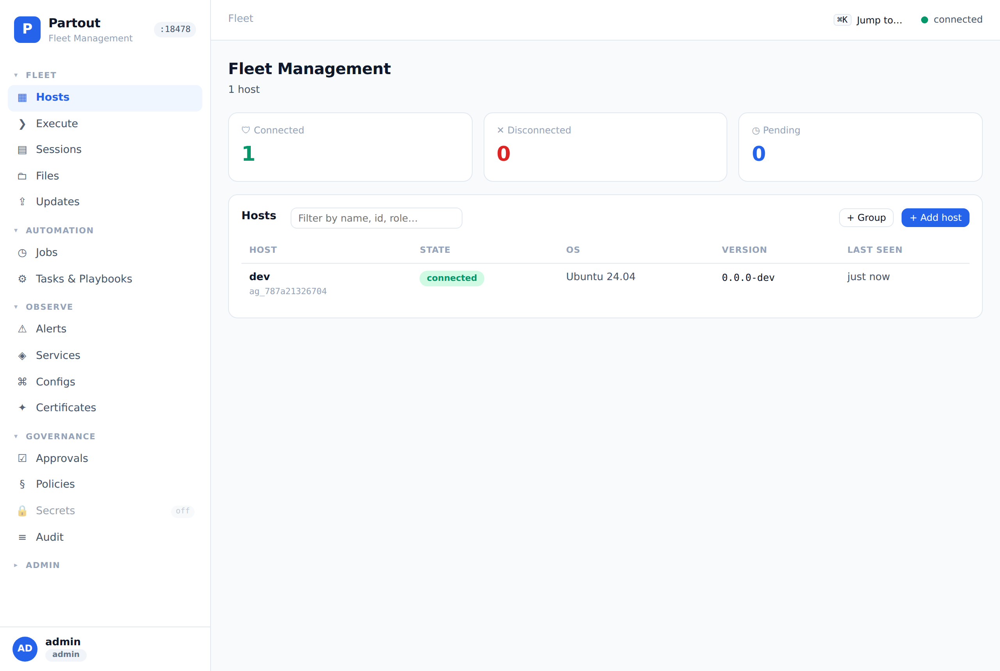
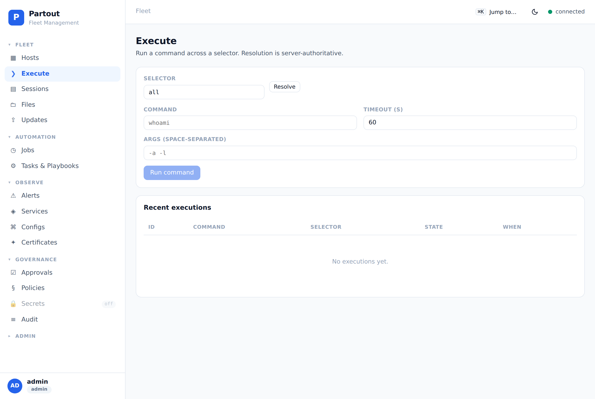
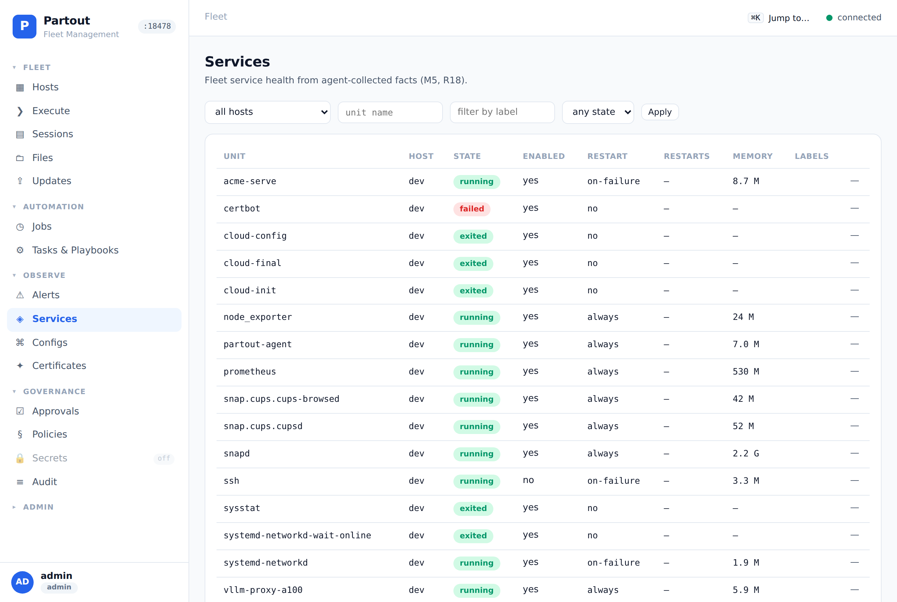
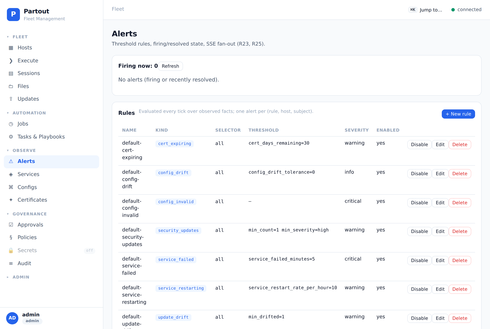
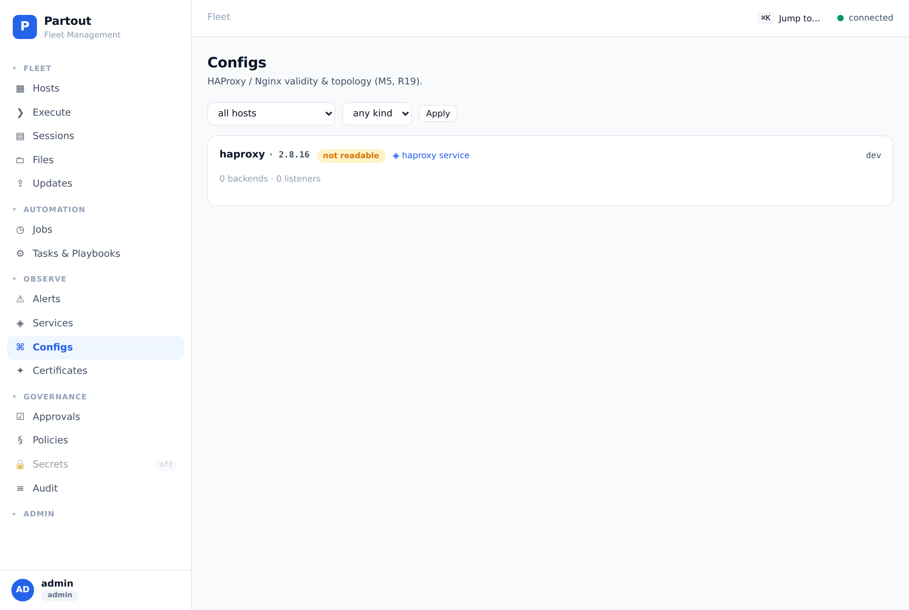
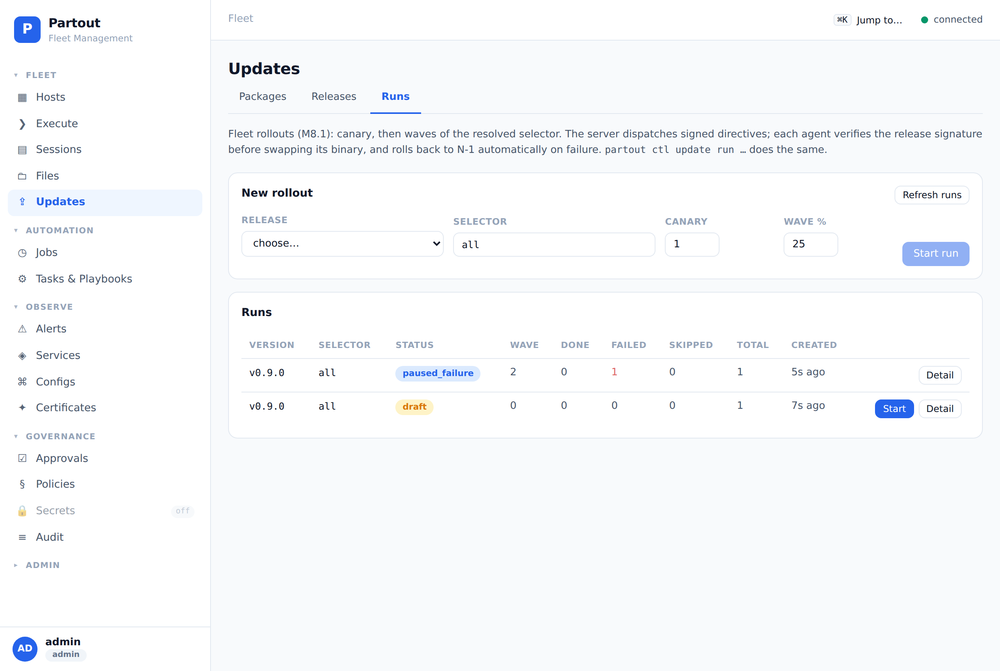
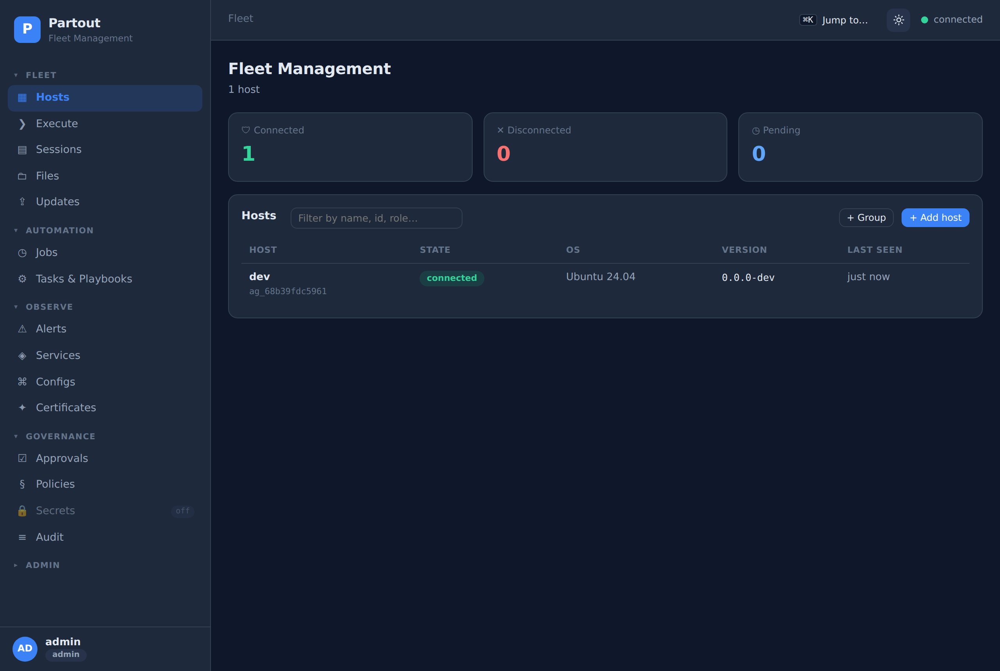
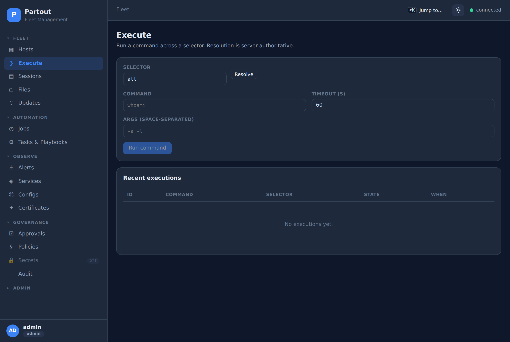

# Partout

> **Status: beta (v0.9.5; v0.9.6 in development)** — the full feature set (observe,
> execute, patch, update rollouts, MCP) is available and self-hosted; expect the
> occasional rough edge and occasional breaking change before 1.0. Back up your
> `partout.db` regularly.

**Partout** is a remote host-management control plane: one Go binary to discover, observe,
execute against, configure, patch, and orchestrate work across Linux hosts — safely,
auditably, and verifiably — with a web UI and an MCP server for AI assistants.

It ships as a single self-hosted binary (no editions, everything free) with an embedded
observe layer, a full write/control path, and an append-only audit log (a cryptographic
hash-chain is a documented post-v1 enhancement, PRD Decision 5).

## The problem it solves

Running a fleet of Linux hosts today means scattered, fragile tooling: `ssh` + copy-pasted
commands (no policy, no audit, nothing to replay), one-off scripts, and a monitoring patchwork.
There is no single system that **reads** (is a service up? is a cert about to expire? does this
config match the rest of the fleet?), **writes** (run a command, ship a file, apply a package,
schedule a job), and **proves it** (an append-only audit trail + live alerts) — with safety
rails on the way through.

Partout unifies that loop — **observe → act → verify** — in one place:

- **Safe** — a policy deny-list gates every dispatch; a `require_approval` rule parks the action
  for a human; the agent re-checks every action locally (fail-closed). A fresh server boots with a
  **preset** of sensible safety-net rules + standard alerts (all `default-*`, editable).
- **Auditable** — every action is an append-only, filterable, exportable audit row.
- **Verifiable** — the agent continuously reports facts (services, TLS certs, webservice configs,
  resources); a server-side alert engine turns them into firing/resolved alerts.

## Architecture

One binary, three modes (`--mode=server|agent|embedded`). The control plane talks to a small
agent on each host over an authenticated gRPC stream; the browser and AI assistants talk to the
same control plane over REST.

```
   Browser (Vue 3 SPA)              MCP client (Claude Code / Cursor / CI)
            │  REST + SSE                      │  JSON-RPC (stdio / HTTP, OAuth2 PKCE)
            ▼                                  ▼
  ┌───────────────────────────────────────────────────────┐
  │  CONTROL PLANE  (one Go binary)                       │
  │  REST API · SSE · embedded Web UI · MCP server        │
  │  policy deny-list · approvals · audit · scheduled jobs│
  │  alert engine · secrets vault · fact store            │
  │  SQLite (WAL) — Postgres planned                      │
  └───────────────────────────────────────────────────────┘
                              │
                              │  gRPC + mTLS  (Enroll · Exec · Files · Sessions ·
                              │            Packages · Tasks · Jobs · Secrets · Facts · Revoke)
                              ▼
                   ┌────────────────────┐
                   │  AGENT  (per host) │
                   │  runs the work     │
                   │  collects facts    │
                   │  guardrail re-check│
                   │  offline spool     │
                   └────────────────────┘
```

- **Single binary** — the same build runs as `server`, `agent`, or `embedded` (server + a local
  agent in one process for instant demos).
- **Auth** — Ed25519 handshake gates every stream; optional local root-CA bootstrap gives mTLS
  on the agent stream with **no per-host cert work** (the CA is the only trust anchor).
- **Write path** — commands, files, PTY sessions, packages, tasks/playbooks, and cron jobs all
  flow through the same policy → (optional) approval → signed-decision → agent guardrail chain.
- **Offline-tolerant** — if the stream drops, in-flight work keeps running and is spooled on the
  host, replayed on reconnect.

## Web UI

A buildless Vue 3 SPA, served same-origin (no CDN, no build step). Fleet + health cards, live
command execution, an xterm.js terminal, files browser (jailed to the host's file root,
default `/home/partout`), jobs/tasks/updates, secrets, policies,
approvals, provisioning, users, and the Observe pages (Services, Certificates, Configs, Alerts).
Light + dark themes — the topbar toggle persists per-browser and defaults to the OS
`prefers-color-scheme`.

| | |
|---|---|
|  |  |
|  |  |
|  |  |
|  |  |

## Quick start

Build once (or grab the prebuilt static binary from the latest
[release](https://github.com/blawesom/partout/releases) — `partout_<version>_linux_<arch>`,
SHA-256SUMS included — if you don't have a Go toolchain), then run a server and an
agent (or an all-in-one demo process).

```bash
go build -o partout ./cmd/partout
```

**Check the host first.** `partout doctor` runs a pre-flight (port free, DB
writable, TLS, outbound CVE/EOL data, SSH key for provisioning) and exits
non-zero on a hard failure — the "start it and see" step, made visible:

```bash
./partout doctor && ./partout   # doctor reports exactly what would stop a start
```

> **Plain HTTP is the default — and loopback-only is the safe default.** A fresh
> server binds **all interfaces** with **no TLS**, so the login password and session
> tokens cross the network in cleartext the moment you reach it from another
> machine. `partout doctor` warns about exactly this. For anything beyond this
> machine, do one of:
>
> - `PARTOUT_TLS=on` — bootstraps a local root CA; the server then serves HTTPS
>   and the agent stream gets mTLS (no per-host cert work), or
> - `PARTOUT_ADDR=127.0.0.1` — keep it on loopback behind your own TLS-terminating
>   reverse proxy (Caddy/nginx/HAProxy patterns in [docs/deployment.md](docs/deployment.md) §1.3).
>
> The browser also warns: the login page shows an amber banner when it is served
> over cleartext from a non-loopback host.

**Fastest path — one-process demo.** Server **and** a co-located local agent; the fleet is
populated the moment you open the UI. No enrollment token or second process needed.

```bash
PARTOUT_MODE=embedded PARTOUT_ADMIN_PASSWORD='change-me-123' ./partout
# → open http://localhost:8443, sign in as admin / change-me-123
# (loopback + plaintext is the local-dev posture; add PARTOUT_TLS=on to try HTTPS)
```

**Server + agent (multiple hosts).** TLS on from the start — the CA is bootstrapped
on first run and the agent picks it up at enrollment (`partout ctl ca` fetches it for
existing hosts):

```bash
# 1) Start the server with TLS
PARTOUT_TLS=on PARTOUT_PORT=8443 PARTOUT_DB_PATH=./partout.db PARTOUT_MODE=server \
  PARTOUT_ADMIN_PASSWORD='change-me-123' PARTOUT_TOKEN_ADMIN='cli-admin-token' ./partout

# 2) Mint a one-time enrollment token
PARTOUT_SERVER=localhost:8443 PARTOUT_CTL_TOKEN='cli-admin-token' ./partout ctl enroll-token
# → token: par_enr_…

# 3) Run the agent on the host you want to manage
PARTOUT_SERVER=localhost:8443 PARTOUT_TOKEN='par_enr_…' \
  PARTOUT_TLS_CA=<the server CA — `partout ctl ca` prints it> ./partout --mode=agent
```

If you deliberately want plaintext (air-gapped lab, SSH tunnel, testing), the same
flow works without `PARTOUT_TLS`/`PARTOUT_TLS_CA` — but keep it on loopback.

The host appears in the **Fleet** page; Observe facts fill in after the first upload.

A fresh server also seeds a fleet-management **preset** (safety-net policies +
standard alert rules, all named `default-*` — including update-run, update-drift
and security-update alerts) on first boot — review it under **Policies** and
**Alerts**, or `partout ctl preset show`. Uploading an agent release pre-arms a
parked rollout draft (Start it from the Updates page when ready). The server
also runs a periodic **security scan** (default every 6 h,
`PARTOUT_SECURITY_SCAN_S`) that correlates each host's packages against OSV
CVE data — see the fleet Security card on the Updates page.

For systemd units, Docker/compose, cloud-init, and Helm, see [docs/deployment.md](docs/deployment.md).

### Deployment notes

- **Bind address**: the default listens on all interfaces. Behind a reverse proxy on
  the same host, set `PARTOUT_ADDR=127.0.0.1` so the control plane is only reachable
  through the edge (see docs/deployment.md §1.3 for the Caddy/nginx/HAProxy patterns).
- **Turn on TLS before exposing it**: `PARTOUT_TLS=on` bootstraps a local root CA and serves
  HTTPS + mTLS (the default is plaintext HTTP on all interfaces — fine for loopback/dev).
- **Token env vars** (server): `PARTOUT_ADMIN_PASSWORD` bootstraps the web-UI `admin` user;
  `PARTOUT_TOKEN_ADMIN/_OPERATOR/_VIEWER` are static bearer tokens for the CLI/scripts. The UI
  login form takes only username/password; the CLI takes `--token` / `PARTOUT_CTL_TOKEN`.
- **Agent TLS**: `partout ctl ca` fetches the root CA; ship it to the host as `PARTOUT_TLS_CA`.

## CLI

`partout ctl` drives everything the UI does. A representative set:

```bash
# Auth + discovery
partout ctl auth login --username admin            # store a session token
partout ctl hosts                                   # id, state, version, last seen, tags

# Run a command across a selector, stream output
partout ctl run --selector 'tag:env=prod' -- systemctl status haproxy

# Safety rails
partout ctl policy create --name no-secret --effect deny --command-regex 'secret'
partout ctl approvals list                          # then approve/deny (admin)

# Provision a new host over your existing fleet SSH
partout ctl provision new --host deploy@web01
partout ctl provision key prv_ab12cd34ef56 confirm  # confirm a new host key (no silent TOFU)

# Packages, jobs, tasks
partout ctl packages apply <agent> --dry-run        # apt/dnf dry-run before apply
partout ctl jobs create job.json                    # cron-scheduled task
partout ctl tasks run <task_id> <agent_id>          # run a versioned task/playbook

# Observe
partout ctl alerts list --state firing
partout ctl audit --kind policy.deny --limit 50
```

The full command set: `auth · enroll-token · hosts · run · exec · audit · policy ·
preset · approvals · alerts · provision · ca · tls · files · sessions · jobs · tasks ·
playbooks · packages · cve · services · secrets · update · elevation · db-backup · external-data` (plus the
top-level `partout doctor`, `partout selftest`, `partout update`, and
`partout uninstall` (local removal: `--dry-run`, `--purge`, `--keep-binary`)). `partout ctl
help` prints the full reference.

## Documentation

| Doc | What it covers |
|---|---|
| [PRD.md](PRD.md) | Product spec, positioning, capabilities, decisions |
| [docs/roadmap.md](docs/roadmap.md) | **Milestone plan & status** (M0–M8.1 done; 1.0 in preparation) + shipped feature deep-dives |
| [docs/architecture.md](docs/architecture.md) | Module layout, stream protocol, state machines, storage, security, testing |
| [docs/deployment.md](docs/deployment.md) | Topology, install paths (systemd/Docker/compose/cloud-init/Helm), config reference |
| [docs/operations.md](docs/operations.md) | Day-2 ops: backups, upgrades, runbooks, troubleshooting, compliance |
| [docs/ui-guidelines.md](docs/ui-guidelines.md) | Web UI definition: IA, tokens, components, slice plan |
